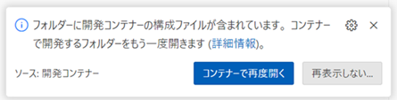
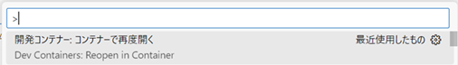

# Python 開発環境

## 概要

DevContainer を利用した Python 用の開発環境

## 開発環境の構築

1. 以下のアプリケーションをインストールし、起動する

   ```batch
   winget install -e --id Microsoft.VisualStudioCode
   winget install -e --id suse.RancherDesktop
   ```

2. Visual Studio Code に以下の拡張機能をインストールする

   [Remote Development](https://marketplace.visualstudio.com/items?itemName=ms-vscode-remote.vscode-remote-extensionpack)

3. Visual Studio Code に本リポジトリを「フォルダを開く」で追加する  
   [ファイル(F)]-[フォルダを開く...]

4. 以下が表示されるので「コンテナーを再度開く」を選択する

   

   もしくは Ctrl+Shift+P で「Dev Containers: ReOpen in Container」を実行する
   

## 構成

### Visual Studio Code の拡張機能

| カテゴリ           | 拡張機能名                                                                                                                                | 説明                             |
| :----------------- | :---------------------------------------------------------------------------------------------------------------------------------------- | :------------------------------- |
| Python             | [Python](https://marketplace.visualstudio.com/items?itemName=ms-python.python)                                                            | Python拡張機能                   |
|                    | [Pylance](https://marketplace.visualstudio.com/items?itemName=ms-python.vscode-pylance)                                                   | 静的解析ツール                   |
|                    | [Python Debugger](https://marketplace.visualstudio.com/items?itemName=ms-python.debugpy)                                                  | デバッガ                         |
|                    | [Ruff](https://marketplace.visualstudio.com/items?itemName=charliermarsh.ruff)                                                            | リンター＆コードフォーマッタ     |
|                    | [autoDocstring](https://marketplace.visualstudio.com/items?itemName=njpwerner.autodocstring)                                              | コメントテンプレート生成         |
| 開発支援ツール     | [IntelliCode](https://marketplace.visualstudio.com/items?itemName=VisualStudioExptTeam.vscodeintellicode)                                 | AI支援                           |
|                    | [IntelliCode API Usage Examples](https://marketplace.visualstudio.com/items?itemName=VisualStudioExptTeam.intellicode-api-usage-examples) | AI支援（APIの使用例表示）        |
|                    | [IntelliCode Completions](https://marketplace.visualstudio.com/items?itemName=VisualStudioExptTeam.vscodeintellicode-completions)         | AI支援（コード補完）             |
|                    | [Code Spell Checker](https://marketplace.visualstudio.com/items?itemName=streetsidesoftware.code-spell-checker)                           | スペルチェッカー                 |
|                    | [YAML](https://marketplace.visualstudio.com/items?itemName=redhat.vscode-yaml)                                                            | リンター＆コードフォーマッタ     |
|                    | [VS Code Counter](https://marketplace.visualstudio.com/items?itemName=uctakeoff.vscode-counter)                                           | ステップカウンター               |
|                    | [Bookmarks](https://marketplace.visualstudio.com/items?itemName=alefragnani.Bookmarks)                                                    | ブックマーク                     |
|                    | [Error Lens](https://marketplace.visualstudio.com/items?itemName=usernamehw.errorlens)                                                    | エラーメッセージのインライン表示 |
|                    | [Material Icon Theme](https://marketplace.visualstudio.com/items?itemName=PKief.material-icon-theme)                                      | アイコン                         |
| AWS                | [AWS Toolkit](https://marketplace.visualstudio.com/items?itemName=AmazonWebServices.aws-toolkit-vscode)                                   | AWS 操作                         |
| Markdown           | [Markdown Preview Enhanced](https://marketplace.visualstudio.com/items?itemName=shd101wyy.markdown-preview-enhanced)                      | Markdownプレビュー               |
|                    | [markdownlint](https://marketplace.visualstudio.com/items?itemName=DavidAnson.vscode-markdownlint)                                        | リンター                         |
|                    | [Markdown Table](https://marketplace.visualstudio.com/items?itemName=TakumiI.markdowntable)                                               | Markdownのテーブル作成支援       |
|                    | [Paste Image](https://marketplace.visualstudio.com/items?itemName=mushan.vscode-paste-image)                                              | 画像の貼り付け                   |
| Docker             | [Docker](https://marketplace.visualstudio.com/items?itemName=ms-azuretools.vscode-docker)                                                 | コンテナ管理                     |
|                    | [Container Tools](https://marketplace.visualstudio.com/items?itemName=ms-azuretools.vscode-containers)                                    | コンテナ管理                     |
| ドキュメント       | [Draw.io Integration](https://marketplace.visualstudio.com/items?itemName=hediet.vscode-drawio)                                           | 作図ツール                       |
|                    | [OpenAPI (Swagger) Editor](https://marketplace.visualstudio.com/items?itemName=42Crunch.vscode-openapi)                                   | OpenAPI エディタ                 |
| テスト             | [REST Client](https://marketplace.visualstudio.com/items?itemName=humao.rest-client)                                                      | HTTP リクエストツール            |
| Visual Studio Code | [Japanese Language Pack for Visual Studio Code](https://marketplace.visualstudio.com/items?itemName=MS-CEINTL.vscode-language-pack-ja)    | 日本語化                         |
