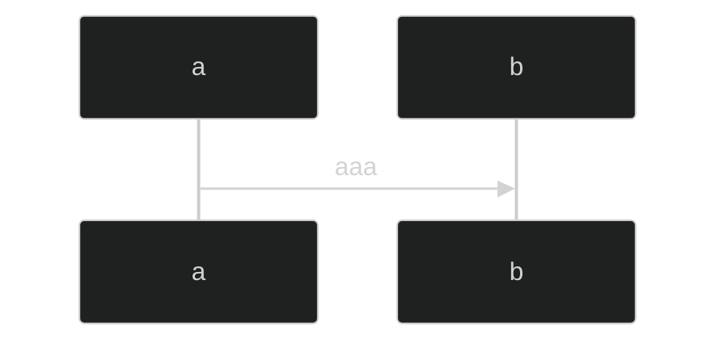

# ダイアグラム サンプル

## PlantUML

```puml
a -> b: aaa
```

```puml

|要件定義|
:業務フロー;
:システム化業務フロー;

|基本設計|
fork
  :機能一覧;
fork again
  :画面一覧;
fork again
  :帳票一覧;

|詳細設計|

|製作|


|結合試験|


|総合試験|

```

## Mermaid


